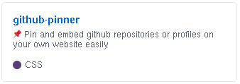

<p align="center">
  <br><br>
<a href="https://www.gnu.org/licenses/gpl-3.0">
  
</a>
  
  
</p>


# Overview 
Do you want to showcase a github repository or profile on your website? Instead of leaving a simple link, use this tool to create embedded HTML github tiles. It uses GitHub's API to grab the information, so no need to worry about updating html. You can pin profiles, single repositories, or even all repositories linked to an individual profile!

## Usage
Simply set the html **data** field with a GitHub profile, repository, or repositories tab url...
```html
<script src="https://luisboto.github.io/github-pinner/GitHubPinner.js"></script>
<div data="https://github.com/LuisBoto/github-pinner" theme="normal" class="github-pinner" style="visibility: hidden;"></div>
```

## Preview
Setting the html **theme** field sets the look and feel:

- Normal theme (**theme="normal"**):
  <p align="center">
    <br>
    
  </p>
- Dark theme (**theme="dark"**):
  <p align="center">
    <br>
    
  </p>
- Amoled theme (**theme="amoled"**):
  <p align="center">
    <br>
    
  </p>

## TODO
* Implement functionality for a "All Repos" element
* Expanding width "All-repo" section
* Hover-able icon with GitHub Profile popup
